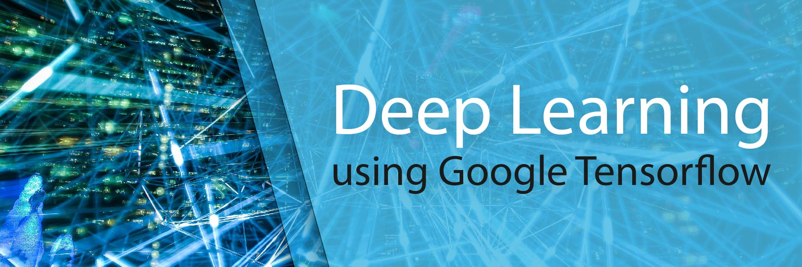

The following course is also availible on Edyoda : https://www.edyoda.com/course/1429/

# Course Content

### Essential Programming

* Introduction to Deep Learning
* Introduction to Numpy
* Introduction to Tensorflow and Keras

### Essential basics of Linear Algebra 

* Solution of Equations, row and column Interpretation

* Vector Space Properties

* Partial Derivative of Polynomial and Two conditions for Local Minima

* Physical Interpretation of gradient (Direction of Maximum Change)

* Matrix Vector Multiplication

* EVD and interpretation of Eighen Vectors

* Linear Independence and Rank of Matrix

* Orthonormal Matrices, Projection Matrices, Vandemonde Matrix, Markov Matrix, Symmetric, Block Diagonal

### Selected topics of Machine Learning

* Intuition behind Linear Regression, classification

* Grid Search

* Gradient Descent

* Training Pipeline

* Metrics - ROC Curve, Precision Recall Curve
* Calculating Entropy

### Basics of Neural Network

* Evolution of Perceptrons, Hebbs Principle, Cat Experiment

* Single layer NN

* Tensorflow Code

* Multilayer NN

* Back propagation, Dynamic Programming

* Mathematical Take on NN

* Function Approximator
*  Link with Linear Regression
* Dropout and Activation
* Optimizers and Loss Functions

### Introduction to Convolutional Neural Network

* 1D and 2D Convolution
*  Why CNN for Images and speech?
*  Convolution Layer
*  Coding Convolution Layer
*  Learning Sharpening using single convolution Layer in Tensor-Flow

### Different Layers in CNN pipeline

* Convolution
*  Pooling
*  Activation
*  Dropout
*  Batch Normalization
*  Object Classification
*  Creating Batch in Tensorflow and Normalize
*  Training MNIST and CIFAR datasets
* Understanding a pre-trained Inception Architecture
*  Input Augmentation Techniques for Images

  ### Transfer Learning

* Finetuning last layers of CNN Model 
* Selecting appropriate Loss
* Adding a new class in the last Layer
* Making a model Fully Convolutional for Deployment
* Finetune Imagenet for Cats vs Dog Classification.

### Object Detection and Localization

*  Different types of problem in Objects
*  Difficulties in Object Detection and Localization
*  Fast RCNN
*  Faster RCNN
*  YOLO v1-v3
*  SSD
*  MobileNet

### Autoencoders

* Image Compression - Simple Autoencoder
*  Denoising Autoencoder
*  Variational Autoencoder and Reparematrization Trick
*  Robust Word Embedding using Variational Autoencoder

### Time Series Modelling

* Evolution of Recurrent Structures
*  LSTM, RNN, GRU, Bi-RNN, Time-Dense
*  Learning a Sine Wave using RNN in Tensorflow
*  Creating Autocomplete for Harry Potter in Tensorflow

### GANs

* Generative vs Discrimative Models

* Theory of GAN

* Simple Distribution Generator in Tensorflow using MCMC (Markov Chain Monte Carlo)

* DCGAN,WGANs for Images

* InfoGANs, CycleGANs and Progressive GANs
* Creating a GAN for generating Manga Art

### Model Free Approaches in Reinforcement Learning

- Model Free Prediction 
- Monte Carlo Prediction and TD Learning
- Model Free Control with REINFORCE and SARSA Learning
- **Assignment** Implementation of REINFORCE and SARSA Learning in Gridworld
- Off policy vs On Policy Learning
- Importance Sampling for Off Policy Learning
- Q Learning 

### Behavioral Cloning and Deep Q Learning

- Understanding Deep Learning as Function Approximator
- Theory of Behavioral Cloning and Deep Q Learning
- Revisiting Point Collector Example in Unity and
- **Assignment  : **Training Cartpole Example via Deep Q Learning

